m---
## Front matter
title: "Отчет по лабораторной работе №2"
subtitle: "Архитектура компьютера"
author: "Арутюнян Эрик Левонович"

## Generic otions
lang: ru-RU
toc-title: "Содержание"

## Bibliography
bibliography: bib/cite.bib
csl: pandoc/csl/gost-r-7-0-5-2008-numeric.csl

## Pdf output format
toc: true # Table of contents
toc-depth: 2
lof: true # List of figures
lot: true # List of tables
fontsize: 12pt
linestretch: 1.5
papersize: a4
documentclass: scrreprt
## I18n polyglossia
polyglossia-lang:
  name: russian
  options:
	- spelling=modern
	- babelshorthands=true
polyglossia-otherlangs:
  name: english
## I18n babel
babel-lang: russian
babel-otherlangs: english
## Fonts
mainfont: PT Serif
romanfont: PT Serif
sansfont: PT Sans
monofont: PT Mono
mainfontoptions: Ligatures=TeX
romanfontoptions: Ligatures=TeX
sansfontoptions: Ligatures=TeX,Scale=MatchLowercase
monofontoptions: Scale=MatchLowercase,Scale=0.9
## Biblatex
biblatex: true
biblio-style: "gost-numeric"
biblatexoptions:
  - parentracker=true
  - backend=biber
  - hyperref=auto
  - language=auto
  - autolang=other*
  - citestyle=gost-numeric
## Pandoc-crossref LaTeX customization
figureTitle: "Рис."
tableTitle: "Таблица"
listingTitle: "Листинг"
lofTitle: "Список иллюстраций"
lotTitle: "Список таблиц"
lolTitle: "Листинги"
## Misc options
indent: true
header-includes:
  - \usepackage{indentfirst}
  - \usepackage{float} # keep figures where there are in the text
  - \floatplacement{figure}{H} # keep figures where there are in the text
---

# Цель работы

Изучить идеологию и применение средств контроля версий. Приобрести практические навыки по работе с системой git. 

# Выполнение лабораторной работы

После создания аккаунта в git я указал в консоли имя и email владельца репозитория (Рис. @fig:001).

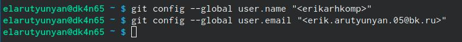{#fig:001 width=70%}

Настроил utf-8 в выводе сообщений git, задал имя "мастер" для начальной ветки, настроил параметры autocrlf and safecrlf
 
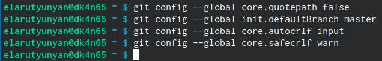{#fig:002 width=70%}

Сгенерировал ключи 

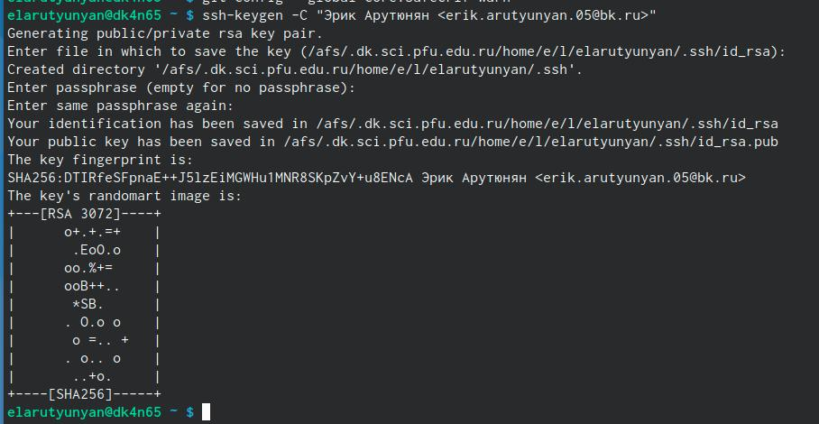{#fig:003 width=70%}

Скопировал из консоли ключ в буфер обмена 

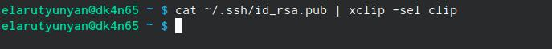{#fig:004 width=70%}

Вставил ключ на сайте и назвал его  "Titlerik".

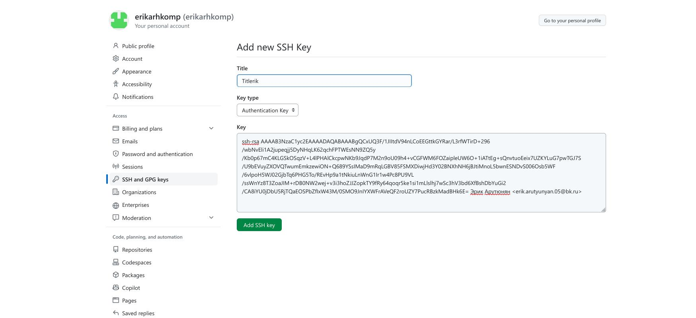{#fig:005 width=70%}

Создал SSH ключ.

{#fig:006 width=70%}

Создал каталог для предмета "Computer architecture"

{#fig:007 width=70%}

Перехожу в каталог курса и клонирую созданный репозиторий 

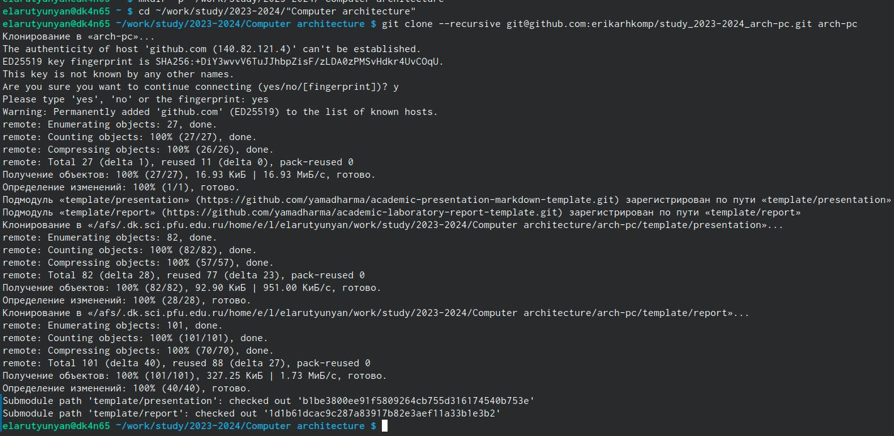{#fig:008 width=70%}

Перешел в каталог курса, удалил лишние файлы и создал необходимые каталоги (рис. @fig:009).

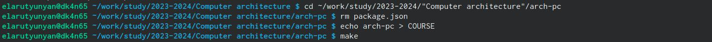{#fig:009 width=70%}

Ввожу команды git add . и git commit -am (рис. @fig:010).

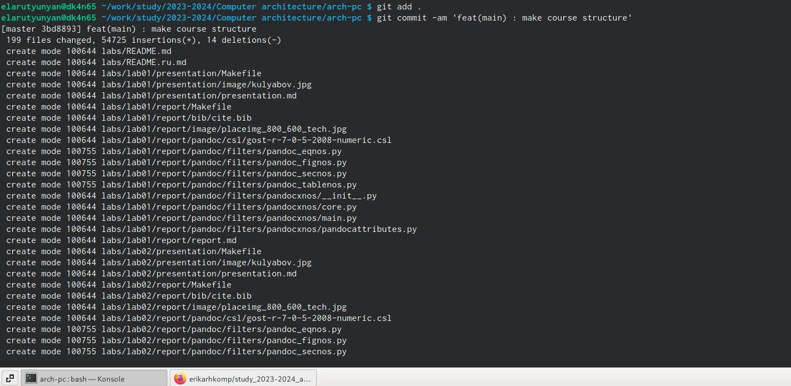{#fig:010 width=70%}

Ввел команду git push и отправил файлы на сервер (Рис. @fig:011).

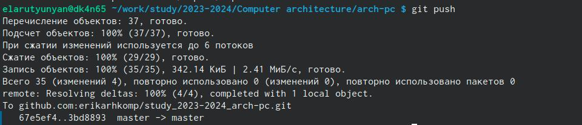{#fig:011 width=70%}

# Выполнение самостоятельной работы 

Скопировал отчет по выполнению первой лабораторной работы в соответствующий каталог созданного рабочего пространства (рис. @fig:012).

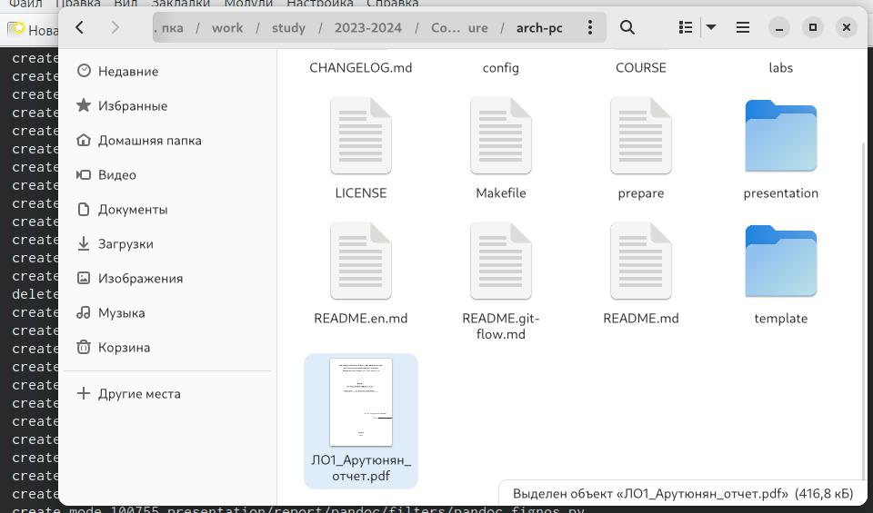{#fig:012 width=70%}

Загрузил файлы в git hub (рис. @fig:013).

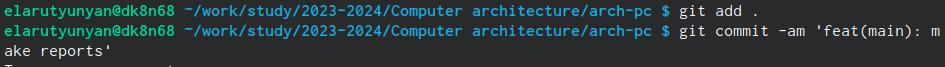{#fig:013 width=70%}

С помощью команды git push передал в удаленный репозиторий изменения, сделанные в локальном репозитории (рис. @fig:014).

{#fig:014 width=70%}

# Выводы

Я ознакомился с принципами работы средств контроля версий. После базовой настройки git создали иерархию рабочего пространства в локальном репозитории  и на странице git hub.

# Список литературы{.unnumbered}

::: {#refs}
:::
