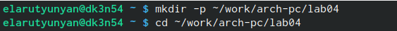
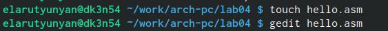
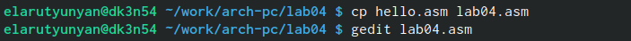
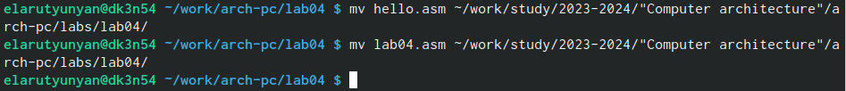
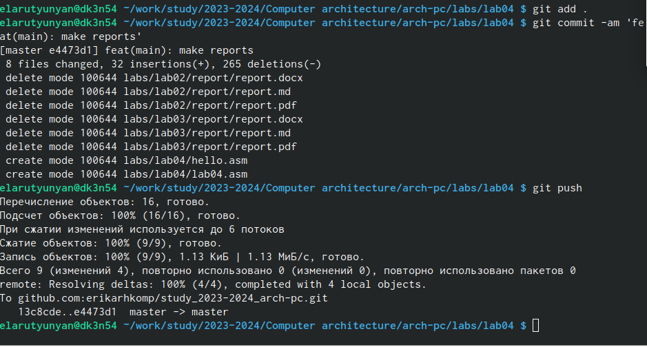

---
## Front matter
title: "Отчет по лабораторной работе №4"
subtitle: "Архитектура компьютеров"
author: "Арутюнян Эрик Левонович"

## Generic otions
lang: ru-RU
toc-title: "Содержание"

## Bibliography
bibliography: bib/cite.bib
csl: pandoc/csl/gost-r-7-0-5-2008-numeric.csl

## Pdf output format
toc: true # Table of contents
toc-depth: 2
lof: true # List of figures
lot: true # List of tables
fontsize: 12pt
linestretch: 1.5
papersize: a4
documentclass: scrreprt
## I18n polyglossia
polyglossia-lang:
  name: russian
  options:
	- spelling=modern
	- babelshorthands=true
polyglossia-otherlangs:
  name: english
## I18n babel
babel-lang: russian
babel-otherlangs: english
## Fonts
mainfont: PT Serif
romanfont: PT Serif
sansfont: PT Sans
monofont: PT Mono
mainfontoptions: Ligatures=TeX
romanfontoptions: Ligatures=TeX
sansfontoptions: Ligatures=TeX,Scale=MatchLowercase
monofontoptions: Scale=MatchLowercase,Scale=0.9
## Biblatex
biblatex: true
biblio-style: "gost-numeric"
biblatexoptions:
  - parentracker=true
  - backend=biber
  - hyperref=auto
  - language=auto
  - autolang=other*
  - citestyle=gost-numeric
## Pandoc-crossref LaTeX customization
figureTitle: "Рис."
tableTitle: "Таблица"
listingTitle: "Листинг"
lofTitle: "Список иллюстраций"
lotTitle: "Список таблиц"
lolTitle: "Листинги"
## Misc options
indent: true
header-includes:
  - \usepackage{indentfirst}
  - \usepackage{float} # keep figures where there are in the text
  - \floatplacement{figure}{H} # keep figures where there are in the text
---

# Цель работы

Освоение процедуры компиляции и сборки программ, написанных на ассемблере NASM.

# Теоретическое введение

Язык ассемблера (assembly language, сокращённо asm) — машинно-
ориентированный язык низкого уровня. Можно считать, что он больше
любых других языков приближен к архитектуре ЭВМ и её аппаратным возмож-
ностям, что позволяет получить к ним более полный доступ, нежели в языках
высокого уровня, таких как C/C++, Perl, Python и пр. Заметим, что получить
полный доступ к ресурсам компьютера в современных архитектурах нельзя,
самым низким уровнем работы прикладной программы является обращение
напрямую к ядру операционной системы. Именно на этом уровне и работают
программы, написанные на ассемблере. Но в отличие от языков высокого уровня
ассемблерная программа содержит только тот код, который ввёл программист.
Таким образом язык ассемблера — это язык, с помощью которого понятным
для человека образом пишутся команды для процессора. Следует отметить, что
процессор понимает не команды ассемблера, а последовательности из нулей и
единиц — машинные коды. До появления языков ассемблера программистам
приходилось писать программы, используя только лишь машинные коды,
которые были крайне сложны для запоминания, так как представляли собой
числа, записанные в двоичной или шестнадцатеричной системе счисления.
Преобразование или трансляция команд с языка ассемблера в исполняемый
машинный код осуществляется специальной программой транслятором —
Ассемблер. Программы, написанные на языке ассемблера, не уступают в качестве
и скорости програм- мам, написанным на машинном языке, так как транслятор
просто переводит мнемонические обозначения команд в последовательности бит (нулей и единиц).

# Выполнение лабораторной работы

 Создаём каталог для работы с программами на языке ассемблера NASM, пере-
ходим в созданый каталог (рис. @fig:001).

{#fig:001 width=70%}

Создаём файл с именем hello.asm с помощью команды touch,затем открываем
его с помощью команды gedit (рис. @fig:002).

{#fig:002 width=70%}

Для компиляции текста программы “Hello world” написал: nasm -f elf hello.asm,
скомпилировал исходный файл hello.asm в obj.o с помощью команды nasm -o
obj.o -f elf -g -l list.lst hello.asm, передал объектный файл на обработку компо-
новщику с помощью команды ld -m elf_i386 hello.o -o hello, ld -m elf_i386 obj.o -o
main- задал имя создаваемого исполняемого файла (рис. @fig:003).

{#fig:003 width=70%}

# Выполнение самостоятельной работы

В каталоге ~/work/arch-pc/lab04 создал копию файла hello.asm с именем
lab04.asm, открыл редактор, чтобы внести изменения. (рис. @fig:004).

{#fig:004 width=70%}

Оттранслировал полученный текст программы lab04.asm в объектный файл.
Выполнил компоновку объектного файла и запустил получившийся файл.Скопировал оба файла в свой локальный репозиторий в каталог ~/work/study/2023-
2024/“Архитектура компьютера”/arch-pc/lab04/ (рис. @fig:006).

{#fig:006 width=70%}

Загрузил файлы на GitHub (рис. @fig:007).

{#fig:007 width=70%}

# Выводы

Освоил процедуы компиляции и сборки программ, написанных на ассемблере NASM.

# Список литературы{.unnumbered}

::: {#refs}
:::
