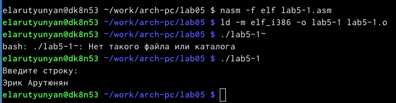
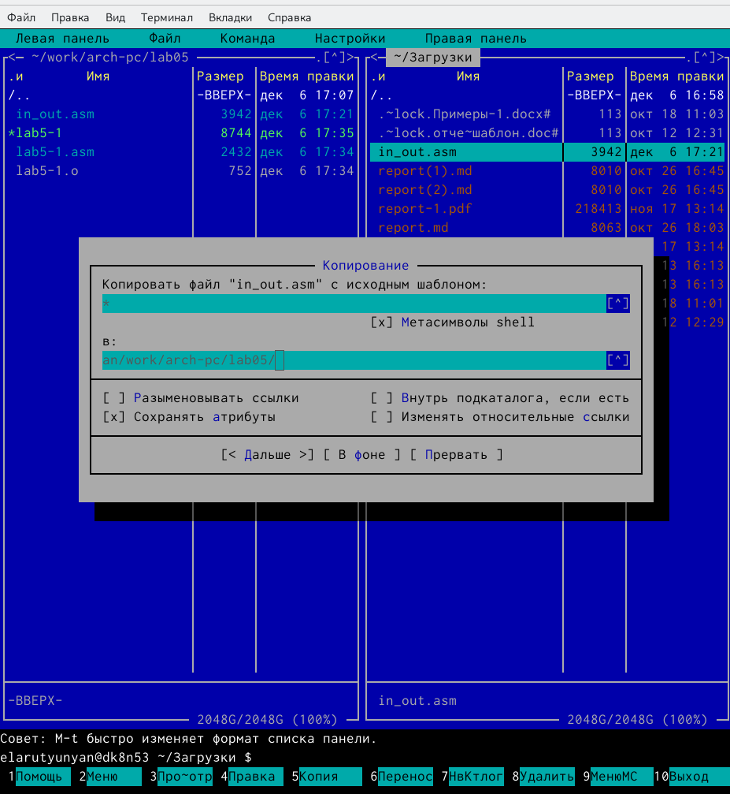
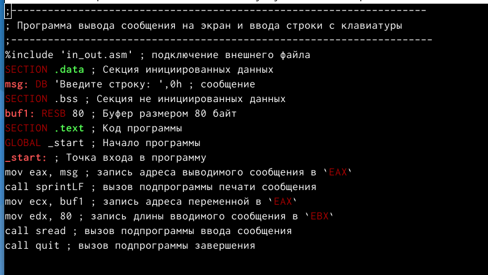
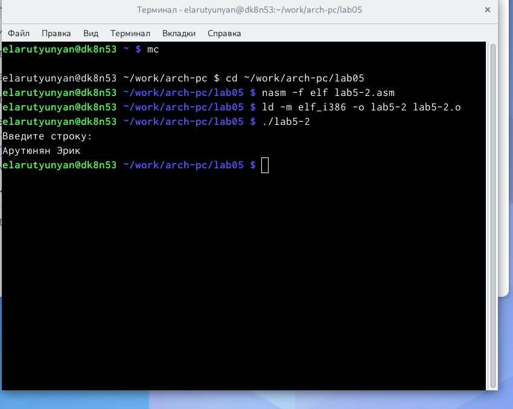
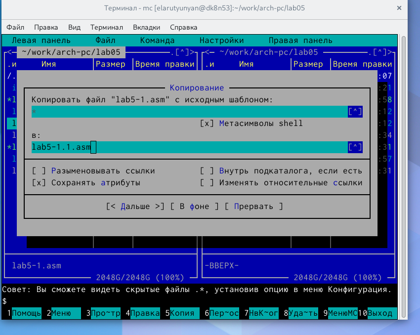
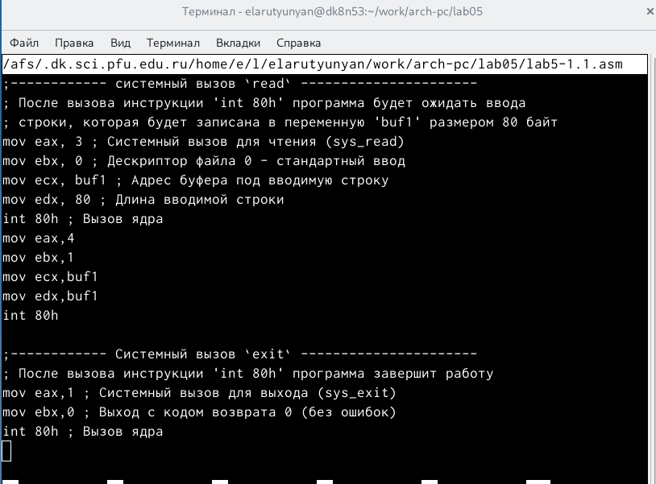
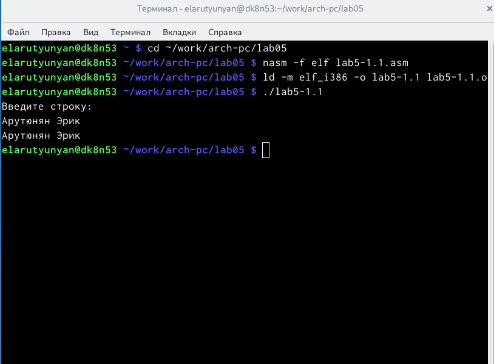
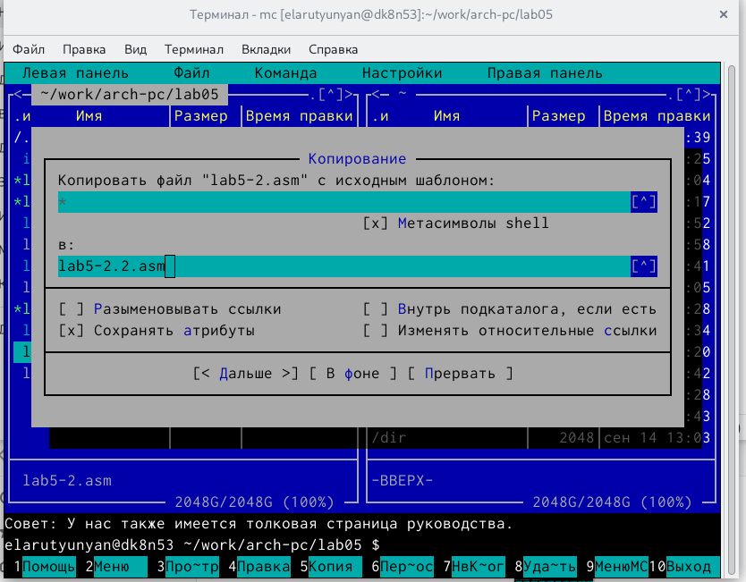
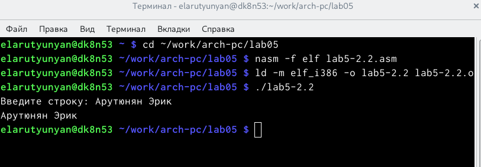

---
## Front matter
title: "Отчет по лабораторной работе №5"
subtitle: "Архитектура компьютеров"
author: "Арутюнян Эрик Левонович"

## Generic otions
lang: ru-RU
toc-title: "Содержание"

## Bibliography
bibliography: bib/cite.bib
csl: pandoc/csl/gost-r-7-0-5-2008-numeric.csl

## Pdf output format
toc: true # Table of contents
toc-depth: 2
lof: true # List of figures
lot: true # List of tables
fontsize: 12pt
linestretch: 1.5
papersize: a4
documentclass: scrreprt
## I18n polyglossia
polyglossia-lang:
  name: russian
  options:
	- spelling=modern
	- babelshorthands=true
polyglossia-otherlangs:
  name: english
## I18n babel
babel-lang: russian
babel-otherlangs: english
## Fonts
mainfont: PT Serif
romanfont: PT Serif
sansfont: PT Sans
monofont: PT Mono
mainfontoptions: Ligatures=TeX
romanfontoptions: Ligatures=TeX
sansfontoptions: Ligatures=TeX,Scale=MatchLowercase
monofontoptions: Scale=MatchLowercase,Scale=0.9
## Biblatex
biblatex: true
biblio-style: "gost-numeric"
biblatexoptions:
  - parentracker=true
  - backend=biber
  - hyperref=auto
  - language=auto
  - autolang=other*
  - citestyle=gost-numeric
## Pandoc-crossref LaTeX customization
figureTitle: "Рис."
tableTitle: "Таблица"
listingTitle: "Листинг"
lofTitle: "Список иллюстраций"
lotTitle: "Список таблиц"
lolTitle: "Листинги"
## Misc options
indent: true
header-includes:
  - \usepackage{indentfirst}
  - \usepackage{float} # keep figures where there are in the text
  - \floatplacement{figure}{H} # keep figures where there are in the text
---

# Цель работы

Приобретение практических навыков работы в Midnight Commander. Освоение инструкций языка ассемблера mov и int.

# Теоретическое введение

Midnight Commander (или просто mc) — это программа, которая позволяет просматривать структуру каталогов и выполнять основные операции по управлению файловой системой, т.е. mc является файловым менеджером. Midnight Commander позволяет сделать работу с файлами более удобной и наглядной.
Для активации оболочки Midnight Commander достаточно ввести в командной строке mc и нажатьклавишу Enter (рис.5.1).
В Midnight Commander используются функциональные клавиши F1 — F10 , к которым привязаны часто выполняемые операции (табл. 5.1).
Таблица 5.1. Функциональные клавиши Midnight Commander
Функцио-
нальные
клавиши Выполняемое действие
F1 вызов контекстно-зависимой подсказки
F2 вызов меню, созданного пользователем
F3 просмотр файла, на который указывает подсветка в активной панели
F4 вызов встроенного редактора для файла, на который указывает подсветка в активной панели
Функцио- нальные клавиши
Выполняемое действие
 F5 копирование файла или группы отмеченных файлов из каталога, отображаемого в активной панели, в каталог, отображаемый на второй панели
F6 перенос файла или группы отмеченных файлов из каталога, отображаемого в активной панели, в каталог, отображаемый на второй панели
F7 создание подкаталога в каталоге, отображаемом в активной панели
F8 удаление файла (подкаталога) или группы отмеченных файлов
F9 вызов основного меню программы
F10 выход из программы
Следующие комбинации клавиш облегчают работу с Midnight Commander:
 • •
• •
Tab используетсядляпереключениямимеждупанелями;
↑ и ↓ используется для навигации, Enter для входа в каталог или открытия файла
(если в файле расширений mc.ext заданы правила связи определённых расширений файлов с инструментами их запуска или обработки);
Ctrl + u (или через меню Команда > Переставить панели ) меняет местами содержимое правой и левой панелей;
Ctrl + o (или через меню Команда > Отключить панели ) скрывает или возвращает панели Midnight Commander, за которыми доступен для работы командный интерпретатор оболочки и выводимая туда информация.
      Ctrl + x + d (или через меню Команда > Сравнить каталоги ) позволяет сравнить содер- жимое каталогов, отображаемых на левой и правой панелях.
•
Дополнительную информацию о Midnight Commander можно получить по команде man
mc и на странице проекта [3].

# Выполнение лабораторной работы

С помощью команды mc открыл Midnight Commander, нашел файл lab5-1.asm, зашел в него и ввел нужный текст. (рис. @fig:001).

{#fig:001 width=70%}

Оттранслировал текст программы lab5-1.asm в объектный файл. Выполнил компоновку объектного файла и запустил получившийся исполняемый файл и ввел свои имя и фамилию. (рис. @fig:002).

{#fig:002 width=70%}

 Cкопировал файл  lab-1.asm с именем  lab-2.asm (рис. @fig:003).

{#fig:003 width=70%}

После создании копии файла lab5-1.asm с именем lab5-2.asm и редактировал в нем текст (рис. @fig:004).

{#fig:004 width=70%}

Оттранслировал текст программы lab5-2.asm в объектный файл. Выполнил компоновку объектного файла и запустил получившийся исполняемый файл и ввел свои имя и фамилию.(рис. @fig:005).

{#fig:005 width=70%}

#Выполнение самостоятельной работы

Копирую файл lab5-1.asm с именем lab5-1.1.asm (рис. @fig:006).

{#fig:006 width=70%}

Изменяю код программы, добавляя вывод введенной строки (рис. @fig:007).

{#fig:007 width=70%}

Создаю объектный файл lab5-1.1.o, компоную его в исполняемый файл, запус- каю исполняемый файл (рис. @fig:008).

{#fig:008 width=70%}

Копирую файл lab5-2.asm с именем lab5-2.2.asm (рис. @fig:009).

{#fig:009 width=70%}

Изменяю код программы, добавляя вывод введенной строки (рис. @fig:010).

{#fig:010 width=70%}

Создаю объектный файл lab5-2.2.o, компоную его в исполняемый файл, запускаю исполняемый файл (рис. @fig:011).

{#fig:011 width=70%}
# Выводы

Я приобрел практических навыков работы в Midnight Commander. Освоение инструкций языка ассемблера mov и int.

